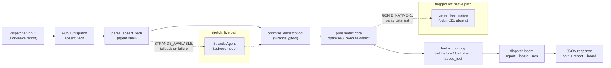

# Architecture

Genie-fleet is a mock-first dispatcher optimizer: a sick-leave report comes
in, the pure `matrix` core re-routes the absent tech's district with minimum
added fuel, and the `optimize_dispatch` Strands tool is the judged
integration. Demo and preview are always safe (zero AWS spend); a live
Bedrock/AgentCore run is stretch and requires explicit human gating.

## Request flow



Notes:

- Offline path (`direct-tool`): `run_dispatch_request` parses the tech name
  and invokes `optimize_dispatch` directly — no model, no credentials. This is
  the path demo, preview, smoke, and replay always take.
- Live path (`strands-agent`, stretch): when the Strands SDK imports, a real
  `Agent` carrying the `optimize_dispatch` tool runs first; any failure falls
  through to the deterministic offline path. The `path` field in every
  response records which branch ran — no mock masquerading as a model.
- Native path (flagged off): `should_use_native` returns true only when the
  caller requests native **and** the compiled `genie_fleet_native` extension
  is importable. Absence is expected, never an error; the pure-Python core
  stays byte-identical (golden replay + `fuel_before`/`fuel_after` +
  `tasks_moved` identical) before any activation.

## Service dependencies

Mock mode (the CI/QA contract) has **no external dependencies**: no network,
no credentials, no daemons. The API boots credential-free with
`GENIE_MODE=mock`.

| Dependency        | Required? | Notes                                              |
|-------------------|-----------|----------------------------------------------------|
| Strands SDK       | No        | Offline fallback keeps core + API testable         |
| AWS Bedrock       | No        | Stretch; live run needs explicit human approval    |
| AgentCore         | No        | Stretch; same gating as Bedrock                    |
| `genie_fleet_native` | No     | Flagged-off C++ seam; absence falls back silently  |

Secrets (`STRANDS_MODEL_ID`, any AWS credentials) are never committed and
never printed in logs or artifacts; `.env` is git-ignored.

## Ports

| Port | Owner here | Notes                                              |
|------|------------|----------------------------------------------------|
| `8002` | genie-fleet API | FastAPI via `mise run dev` / `pitchfork start --all` |
| `8001` / `8788` | call-e (sibling) | Never bind here                           |
| `8000` | ATA (sibling) | Never bind here                                 |
| `3000` / `8787` | WebMCP (sibling) | Never bind here                          |

Off-limits: `22`/`53`/`111`/`631`/`904`/`9000`/`3389`/`34115`/`33519` and
`54620-54630` (Factory Droid MCP). Always `lsof -i -P -n | grep LISTEN`
before binding a new port.

## Endpoints

| Method | Path        | Response                                           |
|--------|-------------|----------------------------------------------------|
| `GET`  | `/health`   | `{"status":"ok"}`                                  |
| `GET`  | `/ready`    | Mode report: `mode`, `version`, `tool` metadata, `techs` |
| `POST` | `/dispatch` | `path` + `absent_tech` + `report` + `board`; unknown tech returns `error` + `known_techs` |

Canned contract: `POST /dispatch {"absent_tech":"Maya"}` moves 2 of 6 tasks
(`report.tasks_moved == 2`, `report.tasks_total == 6`). The `notes` field
(max 500 chars) is appended to the parsed request text.

## Runbook

Fresh-clone setup (idempotent, mock-first):

```bash
mise install && mise run setup && mise run qa
```

Manual equivalent: `mise install` (Python 3.14.7, pitchfork 2.25.0),
`cp .env.example .env` (leave `STRANDS_MODEL_ID` empty),
`pip install -e ".[dev]"`. `mise run setup` seeds `.env` only if missing,
never overwrites.

Start / stop:

```bash
mise run dev                 # uvicorn on 127.0.0.1:8002 (foreground)
pitchfork start --all        # managed daemon instead
pitchfork logs api           # tail the managed API log
pitchfork stop --all         # stop everything (part of rollback)
```

Smoke (one-shot, zero AWS spend, ephemeral port handling built in):

```bash
./scripts/qa_smoke.sh --ephemeral   # or: mise run qa
mise run replay                     # golden-fixture replay
```

Rollback: `pitchfork stop --all`, then `git revert <commit>` (never force-push
`main`; the solo-safe ruleset blocks force-pushes and branch deletion). Each
hardening commit is sliced so a single revert is safe.

Logs:

- Managed service: `pitchfork logs api`.
- Ephemeral smoke: `/tmp/genie-api-<pid>.log` (created per run by
  `scripts/qa_smoke.sh`, cleaned up on exit via trap).
- Secret redaction: the API never logs `STRANDS_MODEL_ID` or AWS credentials;
  keep it that way — grep new log lines for key material before merging.
