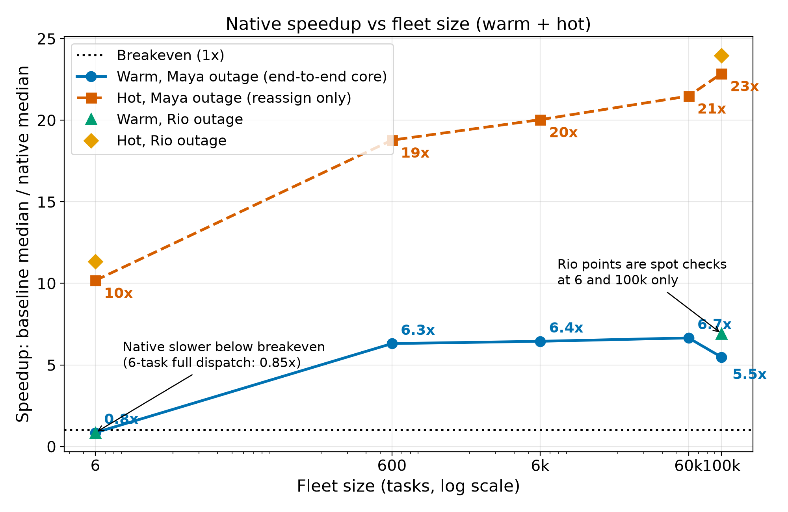
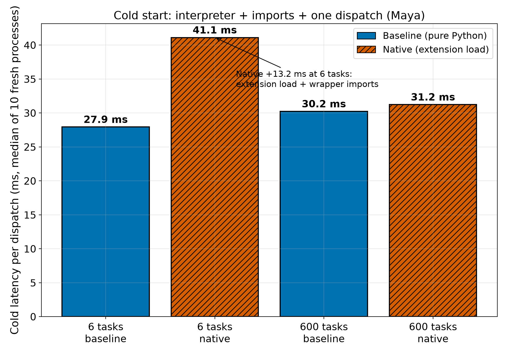
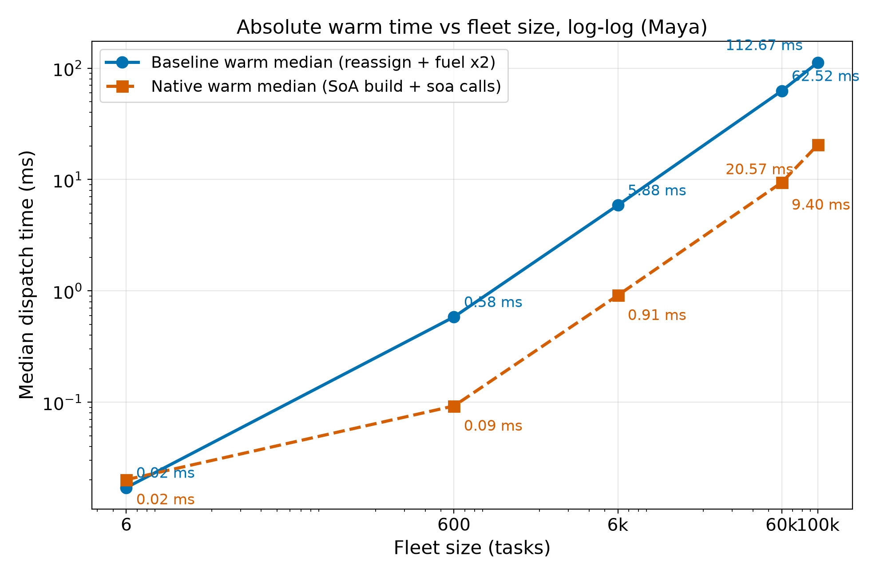

# Benchmarks: baseline Python vs opt-in C++ core

Date: 2026-09-14 (UTC). Mode: `GENIE_MODE=mock`, zero AWS spend, no credentials.
Machine: Linux x86_64 shared host; Python 3.14.7, pybind11 3.1.0, cmake 4.4.3,
ninja 1.13.2 (all via mise). Extension built to a temp dir (Release), loaded via
explicit `importlib` spec, `sys.path` untouched, temp dir deleted afterwards.
Fleets use the `tests/scenarios/test_scale.py` builder pattern verbatim
(seed `20260915`, round-robin techs); Maya outage throughout, Rio added at 6 and
100k only. Medians are the comparator (shared-host noise); speedups are
baseline/native medians.

**Status honesty first:** the C++ core is proven faster at scale but NOT active.
`GENIE_NATIVE` stays default-off; every automated flow (demo, preview, smoke,
replay, tests) runs the pure-Python core. See the tie-flip caveat below for what
blocks activation.

Full numbers, repro commands, and per-cell stats live in-repo at
[`benchmarks/numbers.md`](benchmarks/numbers.md)
(companion to `research/baseline-vs-native.md` and
`research/baseline-vs-native-large.md`). All figures below are transcribed from
that file, never retyped from memory.

## Definitions

- **COLD:** fresh `python -c`-equivalent process per dispatch: interpreter start +
  imports + (native: extension spec-load) + fleet build + ONE dispatch. Wall time via
  `perf_counter` around the whole subprocess. 10 samples per cell; median reported.
- **WARM:** in-process, one warmup excluded, then timed iters: 100 at <=600 tasks,
  20 at 6k, 5 at 60k, 3 at 100k. End-to-end core math: baseline =
  `reassign_sick_leave` + `fleet_fuel` x2; native = fresh SoA build +
  `reassign_sick_leave_soa` + `fleet_fuel_soa` x2. At size 6: canned `optimize` vs
  `try_native_optimize` (full wrapper, incl. report shaping).
- **HOT:** steady-state reassign-only on reused state: baseline =
  `reassign_sick_leave` on the same `Fleet` object; native =
  `ext.reassign_sick_leave_soa` directly on prebuilt, reused SoA buffers (no fuel
  passes). 200 iters at <=6k, 50 at 60k, 20 at 100k.

## Headline: warm speedup per size (median-based)

| Size | Outage | Baseline warm med | Native warm med | Speedup |
|------|--------|------------------|-----------------|---------|
| 6 | Maya | 0.0171 ms | 0.0201 ms | **0.85x** (native slower) |
| 6 | Rio | 0.0171 ms | 0.0203 ms | **0.84x** (native slower) |
| 600 | Maya | 0.5829 ms | 0.0924 ms | **6.31x** |
| 6000 | Maya | 5.8764 ms | 0.9113 ms | **6.45x** |
| 60000 | Maya | 62.5150 ms | 9.3953 ms | **6.65x** |
| 100000 | Maya | 112.6699 ms | 20.5706 ms | **5.48x** |
| 100000 | Rio | 112.6142 ms | 16.2736 ms | **6.92x** |

In round numbers: ~0.85x at 6 tasks, ~6.3x at 600, ~6.4x at 6k, ~6.7x at 60k,
~6.9x at 100k (Rio; the cleaner 100k figure — see note below).

Note: Maya@100k native warm shows one slow iter (mean 23.31 ms, stdev 8.17 ms over
3 iters vs Rio stdev 0.23 ms); the Maya median 20.57 ms is likely noise-inflated and
the Rio 6.92x is the cleaner 100k warm figure.

*Alt-text: "Log-x line chart of native speedup (baseline median divided by native
median) over fleet sizes 6 to 100000 tasks. A dotted black breakeven line marks 1x.
The blue solid circle series (warm Maya, end-to-end core) starts at 0.85x at 6 tasks,
then reads 6.3x, 6.4x, 6.7x and 5.5x at 600, 6k, 60k and 100k. The vermillion dashed
square series (hot Maya, reassign only) reads 10x, 19x, 20x, 21x and 23x. Two
unconnected spot-check markers at 6 and 100k show Rio warm (green triangles, 0.8x and
6.9x) and Rio hot (gold diamonds, 11x and 24x). Annotations note native is slower
below breakeven at the 6-task full dispatch."*

## Hot speedup per size (median-based, reassign-only)

| Size | Outage | Baseline hot med | Native hot med | Speedup |
|------|--------|-----------------|----------------|---------|
| 6 | Maya | 0.0050 ms | 0.0005 ms | **10.2x** |
| 6 | Rio | 0.0078 ms | 0.0007 ms | **11.3x** |
| 600 | Maya | 0.4004 ms | 0.0213 ms | **18.8x** |
| 6000 | Maya | 4.1306 ms | 0.2062 ms | **20.0x** |
| 60000 | Maya | 45.1731 ms | 2.1031 ms | **21.5x** |
| 100000 | Maya | 83.0044 ms | 3.6316 ms | **22.9x** |
| 100000 | Rio | 85.4349 ms | 3.5638 ms | **24.0x** |

Hot isolates the C++ loop from SoA conversion: ~21-24x steady-state on the reassign
math at large sizes, vs ~6-7x warm end-to-end (conversion + fuel passes included).

## Cold-start numbers (median of 10 fresh processes; stdev in brackets)

| Size | Outage | Baseline cold | Native cold | Delta (nat-base) |
|------|--------|--------------|-------------|------------------|
| 6 | Maya | 27.9 ms (0.6) | 41.1 ms (0.9) | **+13.2 ms** |
| 6 | Rio | 28.6 ms (1.4) | 41.4 ms (0.5) | **+12.8 ms** |
| 600 | Maya | 30.2 ms (1.1) | 31.2 ms (5.0) | +1.0 ms |
| 6000 | Maya | 49.4 ms (1.2) | 44.7 ms (1.0) | -4.7 ms |
| 60000 | Maya | 239.9 ms (53.7) | 183.7 ms (2.8) | -56.2 ms |
| 100000 | Maya | 385.9 ms (8.7) | 288.2 ms (4.4) | -97.7 ms |
| 100000 | Rio | 385.5 ms (6.2) | 288.9 ms (5.0) | -96.6 ms |

Story: at 6 tasks the cold dispatch is ~28 ms of interpreter+import fixed cost and the
native path adds ~13 ms (extension file load + wrapper imports) for a ~0.02 ms math
kernel. By 600 tasks the gap is noise (+1.0 ms); past 6k the faster native math
outweighs the load cost even cold. (60k baseline stdev 53.7 ms = one slow outlier,
shared host.)

*Alt-text: "Bar chart of cold-start latency, median of 10 fresh processes, Maya
outage. Four bars: 6 tasks baseline 27.9 ms (solid blue), 6 tasks native 41.1 ms
(hatched vermillion), 600 tasks baseline 30.2 ms (solid blue), 600 tasks native
31.2 ms (hatched vermillion). An annotation notes native costs an extra 13.2 ms at
6 tasks from extension load plus wrapper imports; by 600 tasks the gap is about
1 ms. Series are distinguished by both color and hatching."*

*Alt-text: "Log-log line chart of median warm dispatch time in milliseconds over
fleet sizes 6 to 100000 tasks (Maya). The blue solid circle series (baseline:
reassign plus two fuel passes) runs from 0.02 ms to 112.67 ms; the vermillion dashed
square series (native: SoA build plus extension calls) runs from 0.02 ms to
20.57 ms. Both series are near-straight lines, showing linear scaling with a roughly
6x constant-factor gap; every point carries a direct millisecond label."*

## Crossover story

Warm end-to-end (the number that matters for a dispatch call): native loses at the
6-task canned size (0.85x — the 0.02 ms math kernel cannot amortize SoA conversion
plus wrapper cost) and wins clearly by 600 tasks (6.31x). Interpolating between those
two measured points puts breakeven on the order of tens of tasks (~20-30); it was not
measured directly, so treat the range as a rough estimate, not a data point. Past
breakeven the warm curve is flat (~6-7x): both implementations scale linearly and the
gap is a constant factor, confirmed by the near-straight absolute-time lines above.
Hot (reassign-only) crosses earlier and climbs to ~21-24x because it excludes the
conversion cost entirely.

## Correctness per cell

| Size | Outage | Owners | Fuel 2dp | Moved (base / nat) | Full-report byte-eq |
|------|--------|--------|----------|--------------------|---------------------|
| 6 | Maya | equal | 22.43 / 22.43 | 2 / 2 | PASS (`optimize` JSON, `sort_keys=True`) |
| 6 | Rio | equal | 29.28 / 29.28 | 2 / 2 | PASS |
| 600 | Maya | 600/600 | 5001.91 / 4285.84 both | 200 / 200 | PASS (`dispatch_report` JSON) |
| 6000 | Maya | 6000/6000 | 50271.62 / 43110.63 both | 2000 / 2000 | PASS (`dispatch_report` JSON) |
| 60000 | Maya | 59999/60000, 1 diff @task 56064 | 506372.96 / 432258.44 both | 20000 / 20000 | not attempted (O(n*moved) shaping, both paths) |
| 100000 | Maya | 99999/100000, 1 diff @task 56064 | 843727.39 / 720567.77 both | 33334 / 33334 | not attempted |
| 100000 | Rio | 100000/100000 | 843727.39 / 798326.31 both | 33333 / 33333 | not attempted |

Cold cells: moved + fuel_after agreed baseline-vs-native in all 7 cells (10/10
samples each). Hot spot-checks: owners equal in all cells including both Maya
large cells at the reassign level measured.

## Caveats (read before citing a speedup)

1. **Exact-tie flip blocks activation.** Task 56064 at (1.82, 1.82) sits on the
   Rio/Sam bisector and flips to Sam in C++ (FP-contraction 1-ulp asymmetry) while
   Python breaks the exact tie by name to Rio. Zero fuel impact at 2dp, zero
   moved-count impact — but parity is the activation gate, so the native path stays
   flagged off until this is resolved.
2. **The report-shaping wall.** Full-report byte-equality was proven at 6, 600, and
   6000 tasks and skipped at 60k/100k: the O(n*moved) `by_id` shaping step is shared
   by both paths and dominates wall time at those sizes, so it was not attempted on
   either path.
3. **Shared-host noise.** Medians are the comparator throughout; the Maya@100k warm
   native median is likely noise-inflated (see note under the warm table) and Rio@100k
   6.92x is the cleaner 100k warm figure. The 60k baseline cold/hot stdevs each
   contain one slow outlier.
